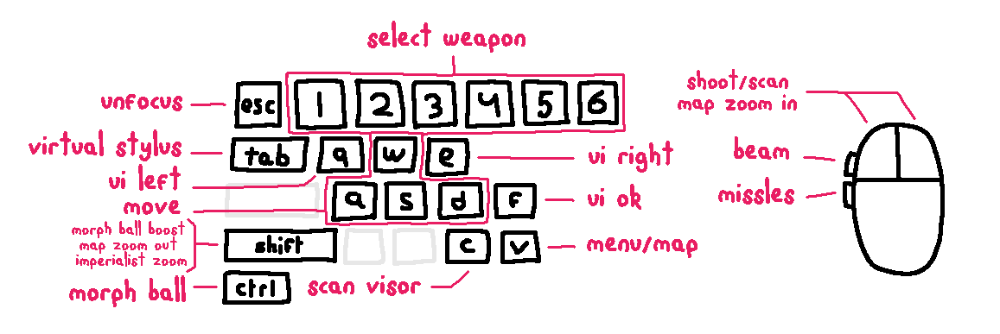

<p align="center"></p>
<h1 align="center"><b>melonPrimeDS</b></h1>
<br>

Modded version of [melonDS](https://melonds.kuribo64.net/) emulator to play Metroid Prime Hunters.

It's a bit of a hack but the goal is to make the game as fun as possible using mouse and keyboard.

I originally made this for controller but because there's no lock-on, it wasn't really fun to play.

**Please read the instructions carefully.**

[](https://ko-fi.com/Q5Q0MLBI)

[melonPrimeDS.webm](https://github.com/makidoll/melonPrimeDS/assets/8362329/69ab26bb-7205-451a-a11c-70a2ca0b549d)

### Download

Releases for [Windows, Linux and macOS here!](https://github.com/makidoll/melonPrimeDS/releases)

[](https://aur.archlinux.org/packages/melonprimeds-bin)


> **⚠️🖱️ Warning if using mouse acceleration!**<br>
> Please disable mouse acceleration or it will feel strange.<br>
> Find a [guide for Windows here](https://www.lifewire.com/turn-off-mouse-acceleration-in-windows-11-5193828) and use [SteerMouse if on macOS](https://plentycom.jp/en/steermouse/index.html)<br>
> Wasn't able to get raw mouse input unfortunately.

> **⚠️ Warning for macOS users!**<br>
> Once you start the program, you're going to have to go into macOS settings:<br>
> **Privacy & Security > Accessibility**, and ensure melonPrimeDS is enabled.

### Instructions

-   Fyi. the emulator hack uses a different config path than melonDS, so this won't conflict

-   Aquire a copy of the **USA 1.1 rom** of Metroid Prime Hunters<br>
    Other regions don't work beacuse memory injection is used

-   Make sure to set all DS bindings to `None` in<br>
    `Config → Input and hotkeys → DS keypad`<br>
    Defaults should already be empty<br>
    _(click binding and press backspace)_

-   Find Metroid related `Keyboard mappings` in<br>
    `Metroid → Input settings`<br>
    Recommended defaults have already been set, but feel free to change them if you want to

    Notes:

    -   Focusing the window will capture your mouse. Use `ESC` to release.
    -   The stylus gets placed in the middle of the DS screen for aiming which can cause accidental presses
    -   Whilst holding the virtual stylus button `Tab`, use your mouse to click around on the touchscreen
    -   UI OK `F` will press "OK" on the touch screen, which will also jump and briefly break aiming
    -   UI left `Q` and right `E` will also press on the touch screen, for scan visor messages
    -   When in map view, press `Shift` to zoom out and `LMB` to zoom in

-   Find Metroid sensitivity settings in<br>
    `Metroid → Other settings`<br>
    <br>
    When in-game, **make sure to set the aim sensitivty to the lowest!**<br>
    The DS touchscreen isn't very precise, so setting it to lowest helps<br>
-   Also recommended to set audio settings in-game to headphones

<br>


### Default settings changed from melonDS

-   Fullscreen toggle set to `F11`
-   Screen layout set to **horizontal**
-   Screen sizing set to **emphasize top**
-   Screen filter set to **false**
-   3D renderer set to **OpenGL**
-   3D scale factor set to **8x** for 1440p
-   JIT recompiler set to **enabled** _(helps with performance)_

VSync was already disabled but keeping it off also helps with performance

### Build

I modified melonDS and played Hunters on Linux. Building is straightforward

```bash
mkdir build
cd build
cmake .. -DCMAKE_BUILD_TYPE=Release -GNinja
ninja
```

Downloadable builds were made using GitHub actions

### Todo

-   ~~Change controls when map is open. Need to find memory location~~
-   Update to latest melonDS
-   ~~Would be really nice if weapon switching was done through the memory~~

<p align="center"></p>
<h1 align="center"><b>melonPrimeDS</b></h1>
<br>

[melonDS](https://melonds.kuribo64.net/)エミュレータの改造版で、Metroid Prime Huntersをプレイするためのもの。
少しハック的ですが、マウスとキーボードを使ってできるだけ楽しくゲームをプレイすることが目的です。
元々はコントローラー用に作りましたが、ロックオン機能がないため、あまり楽しくありませんでした。
**説明をよくお読みください。**

[](https://ko-fi.com/Q5Q0MLBI)

[melonPrimeDS.webm](https://github.com/makidoll/melonPrimeDS/assets/8362329/69ab26bb-7205-451a-a11c-70a2ca0b549d)

### ダウンロード

[Windows、Linux、macOS用のリリースはこちら！](https://github.com/makidoll/melonPrimeDS/releases)

[](https://aur.archlinux.org/packages/melonprimeds-bin)

> **⚠️🖱️ マウス加速を使用している場合の注意！**<br>
> マウス加速を無効にしてください。さもないと違和感があります。<br>
> [Windowsの場合はこちらのガイド](https://www.lifewire.com/turn-off-mouse-acceleration-in-windows-11-5193828)を参照し、[macOSの場合はSteerMouse](https://plentycom.jp/en/steermouse/index.html)を使用してください。<br>
> 残念ながら、生のマウス入力を取得することはできませんでした。

> **⚠️ macOSユーザーへの注意！**<br>
> プログラムを起動したら、macOSの設定で以下の操作が必要です：<br>
> **プライバシーとセキュリティ > アクセシビリティ**で、melonPrimeDSが有効になっていることを確認してください。

### 説明

-   エミュレータのハックはmelonDSとは異なる設定パスを使用するため、競合しません
-   Metroid Prime Huntersの**USA 1.1 ROM**のコピーを入手してください<br>
   メモリインジェクションを使用しているため、他の地域のROMは動作しません
-   必ず以下の場所ですべてのDSバインディングを`None`に設定してください<br>
   `Config → Input and hotkeys → DS keypad`<br>
   デフォルトですでに空になっているはずです<br>
   *（バインディングをクリックしてバックスペースを押してください）*
-   以下の場所でMetroid関連の`キーボードマッピング`を見つけてください<br>
   `Metroid → Input settings`<br>
   推奨のデフォルト設定がすでに設定されていますが、必要に応じて変更してください
   注意点：
   -   ウィンドウにフォーカスするとマウスがキャプチャされます。`ESC`で解放できます。
   -   スタイラスはDS画面の中央に配置され、狙いを定めるために使用されますが、誤ってタッチする可能性があります
   -   仮想スタイラスボタン`Tab`を押しながら、マウスを使用してタッチスクリーンをクリックしてください
   -   UI OK `F`はタッチスクリーンの「OK」を押しますが、ジャンプして一時的に照準が狂う可能性があります
   -   UI左`Q`と右`E`もタッチスクリーンを押し、スキャンバイザーのメッセージに使用します
   -   マップビューでは、`Shift`を押してズームアウト、`LMB`を押してズームインします
-   以下の場所でMetroidの感度設定を見つけてください<br>
   `Metroid → Other settings`<br>
   <br>
   ゲーム内では、**必ず照準感度を最低に設定してください！**<br>
   DSのタッチスクリーンはあまり精密ではないので、最低に設定すると役立ちます<br>
-   ゲーム内でのオーディオ設定をヘッドフォンに設定することもおすすめします

<br>


### melonDSからのデフォルト設定の変更点

-   フルスクリーン切り替えを`F11`に設定
-   画面レイアウトを**横向き**に設定
-   画面サイズを**上画面を強調**に設定
-   画面フィルターを**無効**に設定
-   3Dレンダラーを**OpenGL**に設定
-   3Dスケールファクターを1440p用に**8x**に設定
-   JITリコンパイラを**有効**に設定 *（パフォーマンス向上に役立ちます）*

VSyncはすでに無効になっていましたが、オフのままにするとパフォーマンスの向上に役立ちます

### ビルド

melonDSを修正し、LinuxでHuntersをプレイしました。ビルドは簡単です

```bash
mkdir build
cd build
cmake .. -DCMAKE_BUILD_TYPE=Release -GNinja
ninja
```

ダウンロード可能なビルドはGitHub actionsを使用して作成されました

### Todo

-   ~~マップが開いているときのコントロールを変更する。メモリ位置を見つける必要がある~~
-   最新のmelonDSに更新する
-   ~~武器の切り替えをメモリを通じて行えるようにするとよい~~
